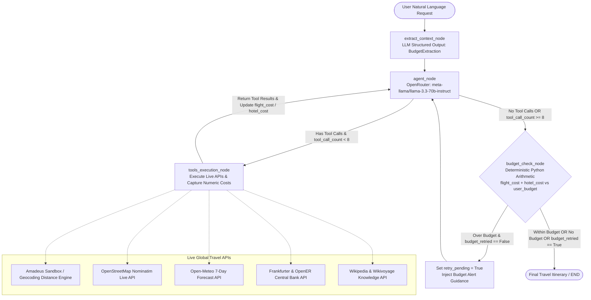

# Trip Planner Agent (trip-planner-agent)

An autonomous, multi-tool travel planning agent built with **LangGraph**, **OpenRouter API** (`meta-llama/llama-3.3-70b-instruct`) / **Groq API**, **Live External APIs**, and a **ChatGPT-style Web Interface**.

- **Live Production URL (Vercel)**: [https://travelagent-sage.vercel.app](https://travelagent-sage.vercel.app)
- **GitHub Repository**: [https://github.com/Arvind007m/travel-planner-agent](https://github.com/Arvind007m/travel-planner-agent)


---

## 1. System Architecture & Workflow

The agent uses a compiled LangGraph state machine that extracts user constraints, dynamically decides and executes live tools, evaluates financial feasibility via deterministic Python arithmetic, and handles automated budget optimization loops.



---

## 2. Core Features

### Multi-Provider LLM Engine (OpenRouter & Groq)
- Primary support for **OpenRouter API** (`meta-llama/llama-3.3-70b-instruct`) providing high-speed tool calling and structured output extraction.
- Automatic fallback support for **Groq API** (`openai/gpt-oss-120b`, `openai/gpt-oss-20b`).

### State-Backed Numeric Calculations
- Replaced fragile free-text LLM re-parsing with dedicated state attributes (`flight_cost: Optional[float]`, `hotel_cost: Optional[float]`, `total_cost: Optional[float]`, `user_budget: Optional[float]`).
- The `budget_check` node performs pure Python arithmetic (`total_cost = flight_cost + hotel_cost`) guarded against `None` values.

### Zero City Hardcoding (Live External APIs)
- All lookup tables and city-name branches have been eliminated. Any city globally (Lisbon, Tokyo, Paris, Rome, London, New York, Cairo, Sydney, etc.) is resolved dynamically.

### State-Based Retry Loop
- Uses a clean state flag (`retry_pending: bool`) instead of string matching on message content.
- If total costs exceed the user budget on the initial search, the agent loops back once to query budget/saver tiers before finalizing.

### Safety Limits & Fault Tolerance
- **Tool Invocations Cap**: Hard limit of 8 tool calls per execution to prevent recursive looping.
- **Date Normalization**: Natural language dates (`"October"`, `"Nov 3rd"`, `"next week"`, `"tomorrow"`) are normalized to ISO `YYYY-MM-DD` strings.

---

## 3. Real-World API Reference

| Tool Name | Provider / Engine | Capabilities |
|---|---|---|
| `search_flights` | Amadeus Sandbox / Open-Meteo Geocoding | ISO date normalization, IATA resolution, great-circle distance (Haversine), flight duration, carrier options, dynamic pricing |
| `search_hotels` | OpenStreetMap Nominatim Live API | Real property listings, real street addresses, ratings, duration stay calculation |
| `get_weather_forecast` | Open-Meteo 7-Day Forecast API | 7-day live weather, temperatures (Celsius and Fahrenheit), precipitation probability %, indoor vs outdoor travel advisory |
| `convert_currency` | Frankfurter Central Bank API / OpenER | Live real-time currency conversions across global currency pairs |
| `get_local_events` | Wikipedia & Wikivoyage Search API | Real recurring festivals, arts gatherings, music concerts, and points of interest |

---

## 4. ChatGPT-Style Web Interface

The project includes a web application built with HTML5, Vanilla CSS, and JavaScript, served via **FastAPI**:

- **Thread-Based History**: The "Recent Trips" sidebar organizes conversations by session threads rather than individual messages.
- **Interactive Tool Execution Drawer**: Collapsible panel on every agent response displaying executed tool names, input arguments, JSON response payloads, and execution duration.
- **Live Budget Status Pill**: Visual badge indicating stated budget vs calculated costs with savings or overage.
- **Client-Side Markdown Parser**: Renders formatted day-by-day itineraries, flight/hotel comparison tables, and tips.

---

## 5. Getting Started

### Prerequisites
- Python 3.10+
- OpenRouter API Key (or Groq API Key)

### Installation & Environment Configuration
1. Clone the repository:
   ```bash
   git clone https://github.com/Arvind007m/travel-planner-agent.git
   cd travel-planner-agent
   ```

2. Install dependencies:
   ```bash
   pip install -r requirements.txt
   ```

3. Create a `.env` file in the root directory:
   ```env
   OPENROUTER_API_KEY=sk-or-v1-...
   OPENROUTER_MODEL=meta-llama/llama-3.3-70b-instruct
   
   # Optional: Groq fallback API key
   # GROQ_API_KEY=gsk_...
   
   # Optional: Live Amadeus GDS Airfare Sandbox
   # AMADEUS_CLIENT_ID=your_amadeus_api_key
   # AMADEUS_CLIENT_SECRET=your_amadeus_api_secret
   ```

---

## 6. Running Locally & On Vercel

### Start the Web Interface Locally
```bash
python app.py
```
Open your browser and navigate to: **[http://127.0.0.1:8000](http://127.0.0.1:8000)**

### Deploying to Vercel via CLI
```bash
npx --yes vercel --prod --yes
```

### Run the Automated CLI Test Suite
```bash
python -u main.py
```
